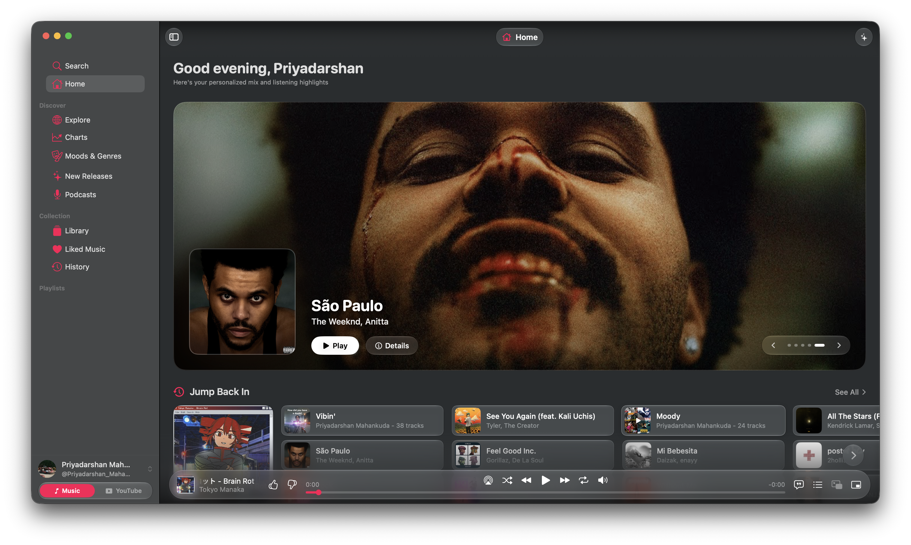
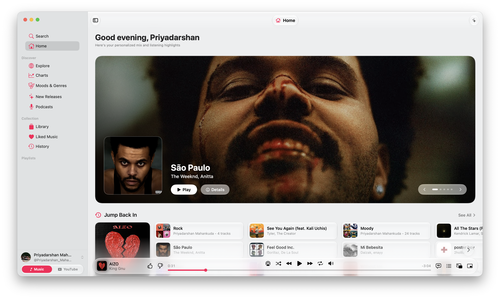
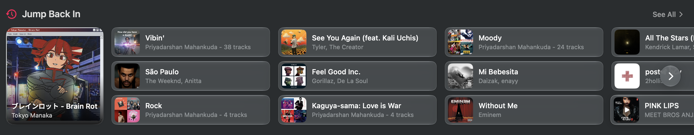
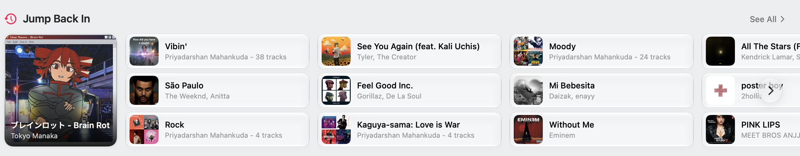
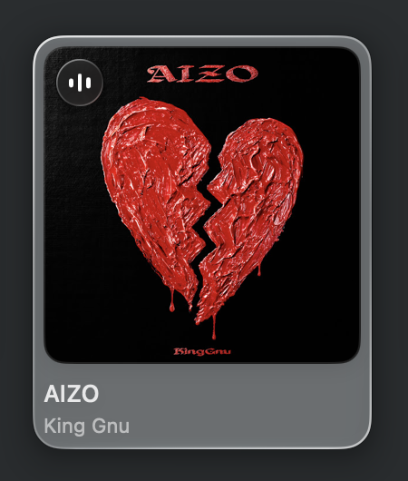
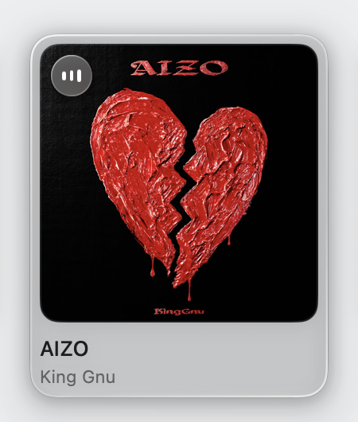
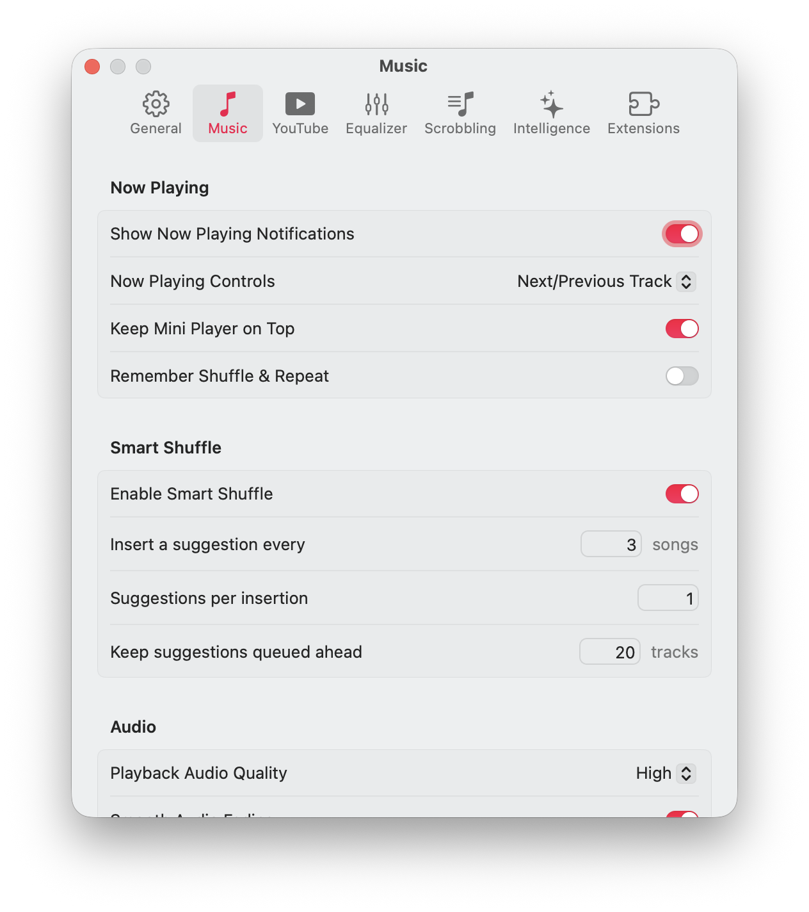

#  Kaset

A native macOS client for YouTube Music and YouTube, built with Swift and SwiftUI.

---

## Design Evolution: Before & After

<table>
  <tr>
    <th width="50%">Original Upstream Interface</th>
    <th width="50%">Redesigned Home Interface</th>
  </tr>
  <tr>
    <td></td>
    <td></td>
  </tr>
  <tr>
    <td valign="top">Standard flat list layout with basic grid carousels.</td>
    <td valign="top">Cinematic Hero spotlight stage, Jump Back In bento shelf, Liquid Glass playing platters, and real-time audio visualizer.</td>
  </tr>
</table>

---

## Appearance Modes

<table>
  <tr>
    <th width="50%">Dark Mode</th>
    <th width="50%">Light Mode</th>
  </tr>
  <tr>
    <td></td>
    <td></td>
  </tr>
</table>

---

## Key Enhancements & New Architecture

### Hero Spotlight Stage
- **Cinematic Artist Backdrop**: High-resolution artist imagery with an organic radial vignette that smoothly blends into the app background.
- **Multi-Spotlight Carousel**: Curated rotation of heavy-rotation tracks and mixes with one-click direct playback and detail navigation.

### Jump Back In Bento Grid
- **Adaptive 1:1 Primary Tile**: Focuses on your most relevant recent session with full-bleed artwork.
- **Split Interaction Model**: Clicking the album artwork directly triggers playback (replaying from 0:00 if already active); clicking the song title or metadata opens the album or playlist details.
- **Frosted Quick-Pick Columns**: 3-row horizontal tracks designed with subtle Liquid Glass hover states and balanced layout margins.

<table>
  <tr>
    <th width="50%">Jump Back In (Dark Mode)</th>
    <th width="50%">Jump Back In (Light Mode)</th>
  </tr>
  <tr>
    <td></td>
    <td></td>
  </tr>
</table>

### Active Playing Platter & Audio Visualizer
- **Liquid Glass Platter**: The currently playing song card gets an elevated translucent glass border that reflects the surrounding background without clipping shadows.
- **Dynamic 3-Dot Visualizer Badge**: A frosted glass pill in the top-left corner with 3 animated audio frequency bars that indicate active playback.

<table>
  <tr>
    <th width="50%">Playing Card Platter (Dark Mode)</th>
    <th width="50%">Playing Card Platter (Light Mode)</th>
  </tr>
  <tr>
    <td></td>
    <td></td>
  </tr>
</table>

### In-Engine Audio Fading
- **Equal-Power Volume Ramps**: Uses cosine/sine curves for natural acoustic transitions on play, pause, and skip instead of sudden cuts.
- **Configurable Preferences**: Full duration adjustment directly inside the native Settings panel.

<table>
  <tr>
    <th width="50%">Audio Settings (Dark Mode)</th>
    <th width="50%">Audio Settings (Light Mode)</th>
  </tr>
  <tr>
    <td></td>
    <td></td>
  </tr>
</table>

### Liquid Glass Floating Topbar
- **Continuous Scroll Blur**: Material mask that softly refracts scrolling content underneath without edge banding or artifacts.
- **Adaptive Appearance Tint**: Dynamically adjusts between dark and light translucent shades to match macOS system appearance.

<p align="left">
  
</p>

---

## Core Capabilities

- **DRM-Protected Playback**: Full streaming support for YouTube Music Premium and standard YouTube video feeds.
- **6-Band Parametric Equalizer**: Audio signal processing with custom presets applied directly to WebKit playback output.
- **Synchronized Lyrics**: Real-time line-by-line lyric tracking with on-device Apple Intelligence analysis on macOS 26+.
- **Smart Shuffle**: On-device queue interleaving based on user listening telemetry and taste profile.
- **System Integration**: Control Center Now Playing widgets, hardware media key listeners, AppleScript automation, and Force Touch haptics.
- **Web Extension Support**: Native WebKit content blocking for uBlock Origin Lite and SponsorBlock.

---

## Build & Installation

### Requirements
- macOS 15.4 or later
- Xcode 16+ / Swift 6.0+

```bash
# Clone the repository
git clone https://github.com/httperry/Kaset.git
cd Kaset

# Build the project
swift build

# Package and run the native .app bundle
./Scripts/compile_and_run.sh --debug
```

---

## Credits & License

Kaset is an open-source native client.
- Built by [httperry](https://github.com/httperry) for Hack Club Macondo.
- Based on the upstream project by [Sertac Ozercan](https://github.com/sozercan/kaset).
