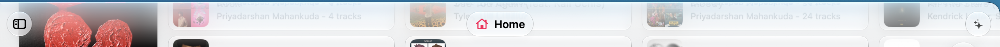

#  Kaset — Liquid Glass Topbar

A native macOS client for YouTube Music and YouTube with a modern Liquid Glass topbar.

---

## Overview

The original topbar used a static header that clipped scrolling content. This redesign implements a floating Liquid Glass material layer that lets album art and titles softly refract as they scroll underneath.

<p align="left">
  
</p>

---

## Technical Highlights

- **Decoupled Blur and Tint**: Separates the background blur material from the color tint gradient, eliminating transparency lines and visual banding.
- **Dynamic Appearance Adaptation**: Automatically shifts between translucent dark and light tints based on macOS system appearance.
- **Traffic Light Clearance**: Aligns navigation pills and back buttons with native window controls.
- **Fullscreen Autohide**: Automatically reveals controls on hover and conceals them during full-bleed fullscreen playback.

---

## Building from Source

```bash
# Clone the repository
git clone -b redesign/topbar https://github.com/httperry/Kaset.git
cd Kaset

# Build and run
swift build
./Scripts/compile_and_run.sh --debug
```
