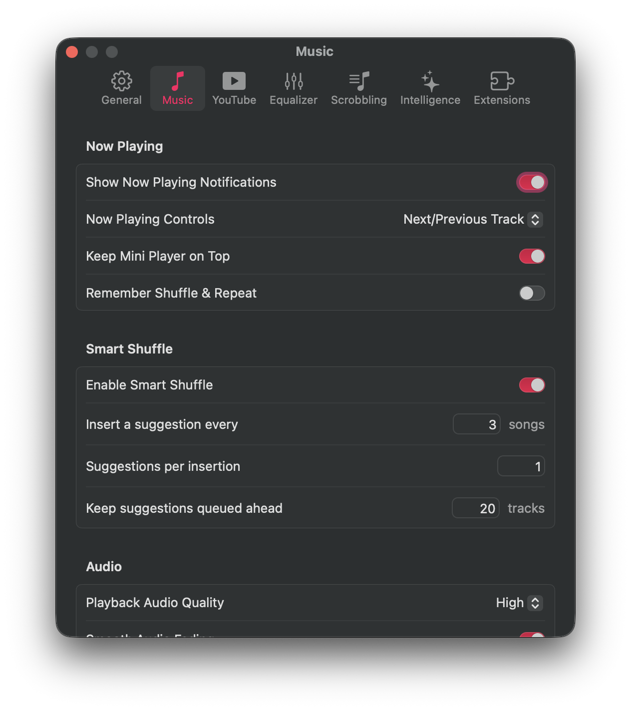

#  Kaset — In-Engine Audio Fading

A native macOS client for YouTube Music and YouTube with in-engine audio fading.

---

## Overview

Abrupt stops and starts during playback can sound jarring. This branch implements in-engine audio fading using equal-power volume curves, ensuring playback ramps down smoothly on pause and ramps up naturally on play.

<p align="left">
  
</p>

---

## Technical Highlights

- **Equal-Power Cosine/Sine Curves**: Replaces linear volume steps with logarithmic curves that match human auditory perception.
- **Re-Entry Protection**: Guard flags prevent volume feedback loops and race conditions during rapid play/pause toggling.
- **Native Settings Integration**: Adds a toggle and duration slider directly to the standard Settings panel under Music → Audio.
- **Unit Test Coverage**: Automated test suites in `AudioFaderServiceTests.swift` verifying curve calculations, cancellation, and volume restoration.

---

## Building from Source

```bash
# Clone the repository
git clone -b feature/audio-fade https://github.com/httperry/Kaset.git
cd Kaset

# Build and run
swift build
./Scripts/compile_and_run.sh --debug
```
